# System Diagrams - DiaryPro

This document contains sequence diagrams and UML diagrams for the DiaryPro application.

---

## Sequence Diagrams

### 1. User Registration Flow

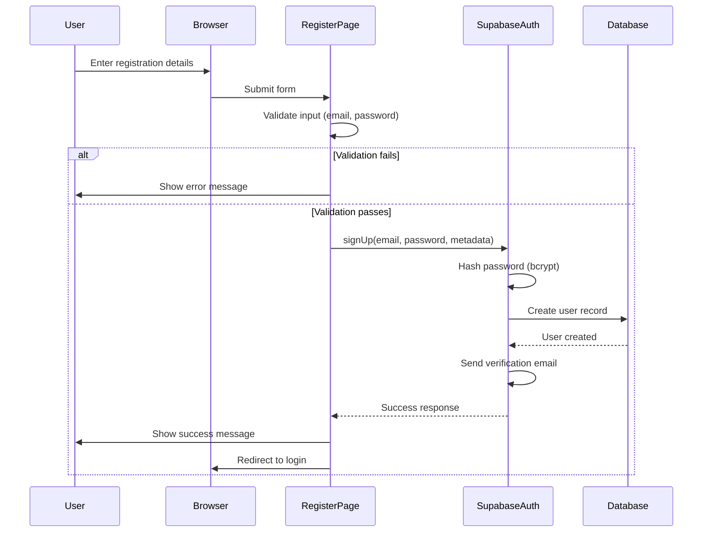

### 2. User Login Flow

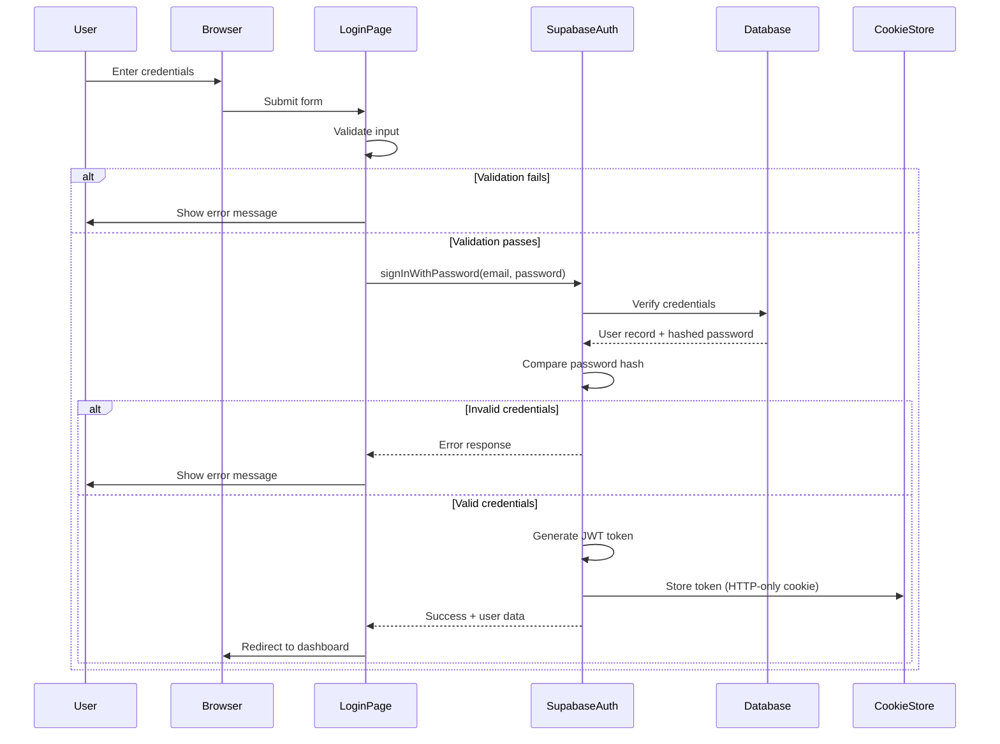

### 3. Entry Creation Flow

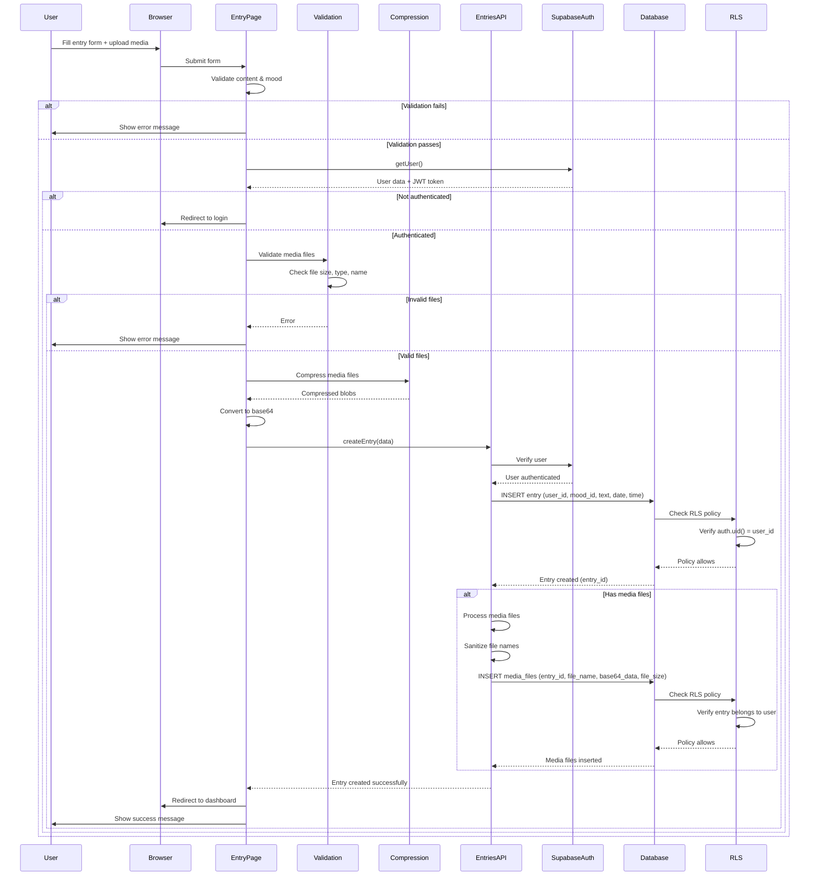

### 4. Entry Access Flow (Security-Enhanced)

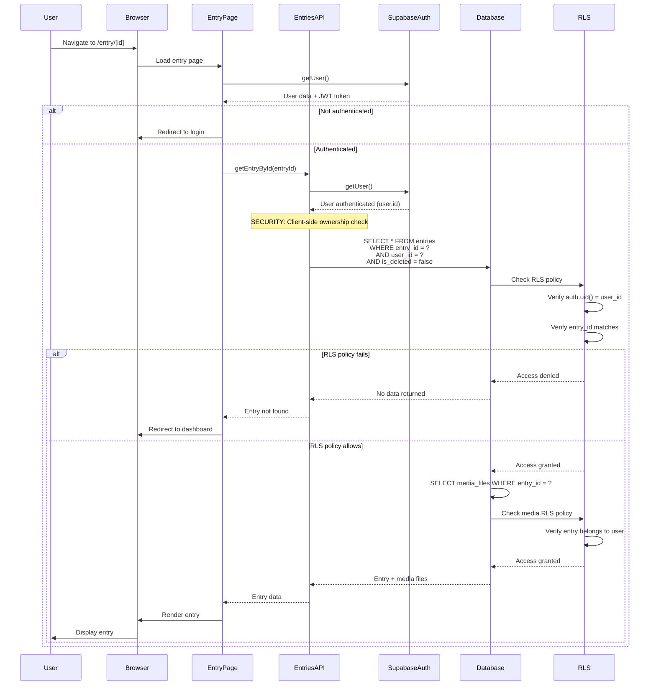

### 5. Entry Update Flow (Security-Enhanced)

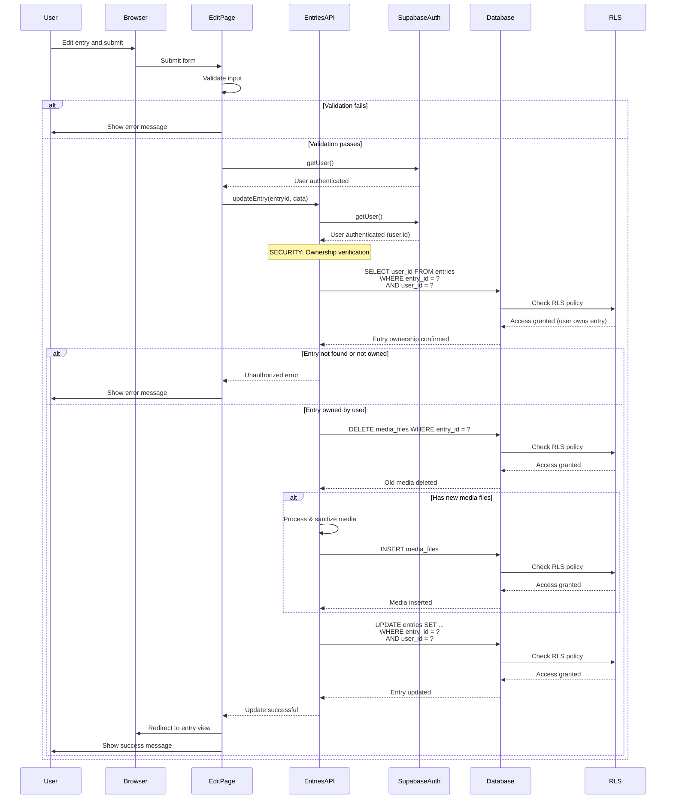

---

## UML Class Diagram

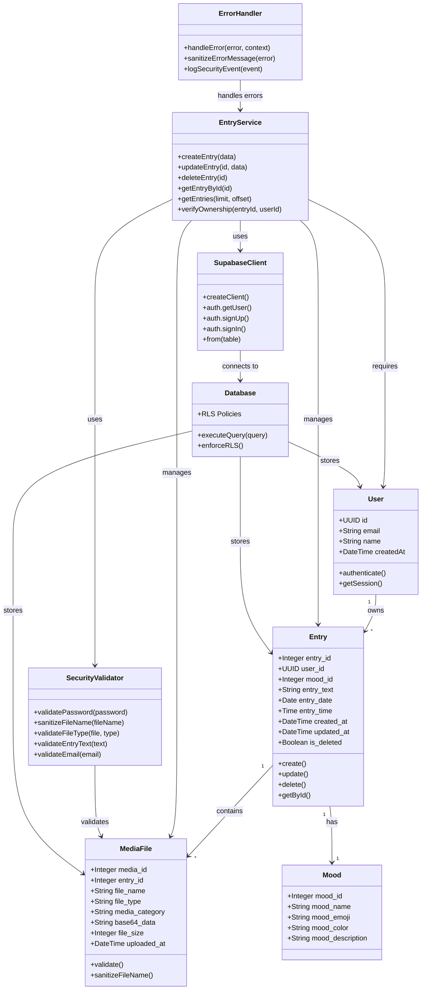

---

## Component Architecture Diagram

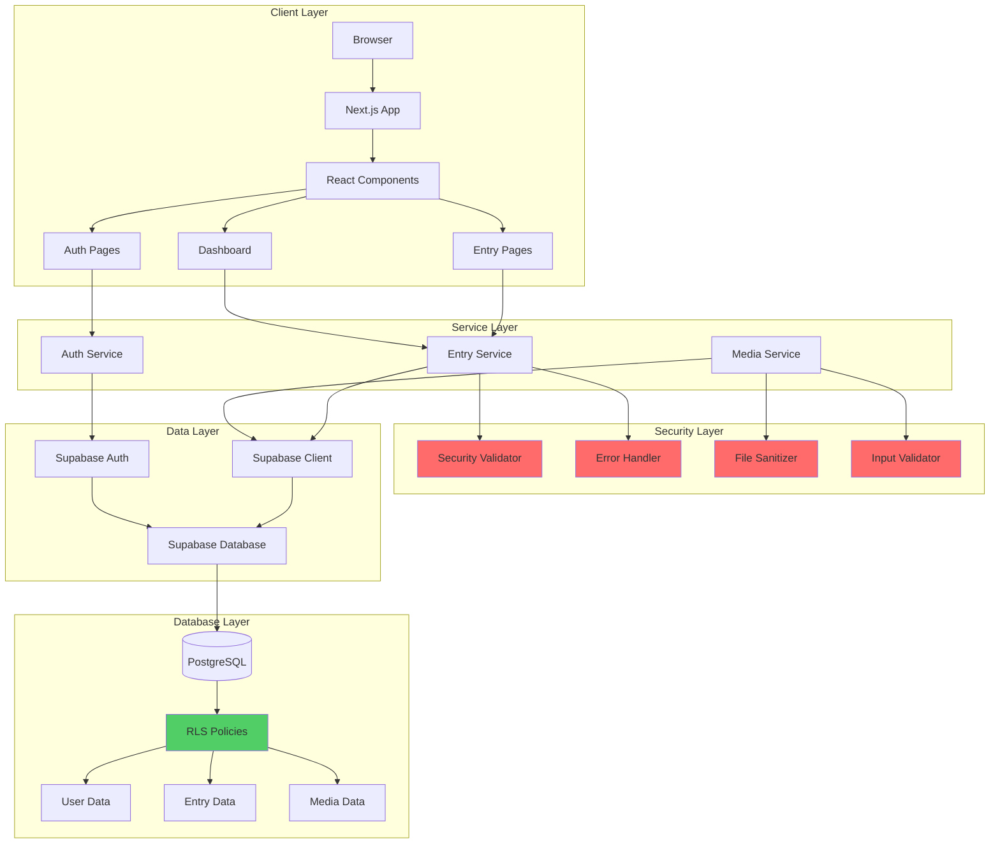

---

## Security Flow Diagram

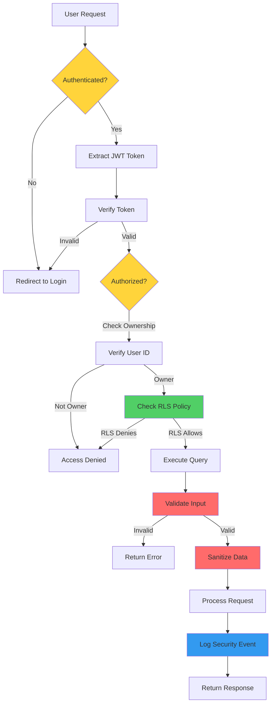

---

## Data Flow Diagram

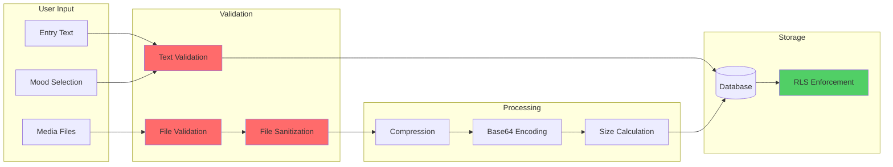

---

## Authentication & Authorization Flow

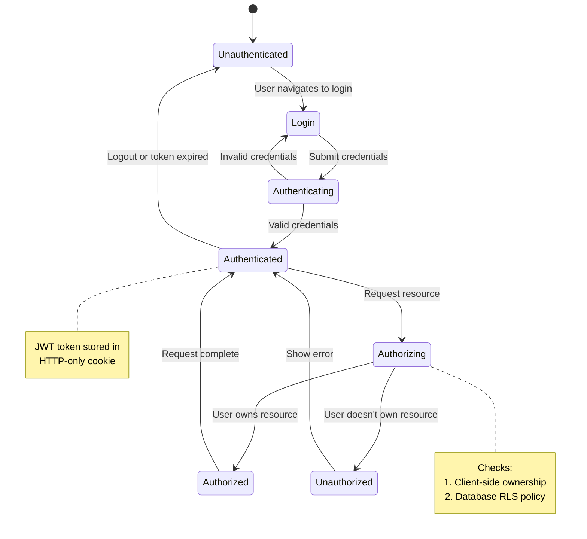

---

## File Upload Security Flow

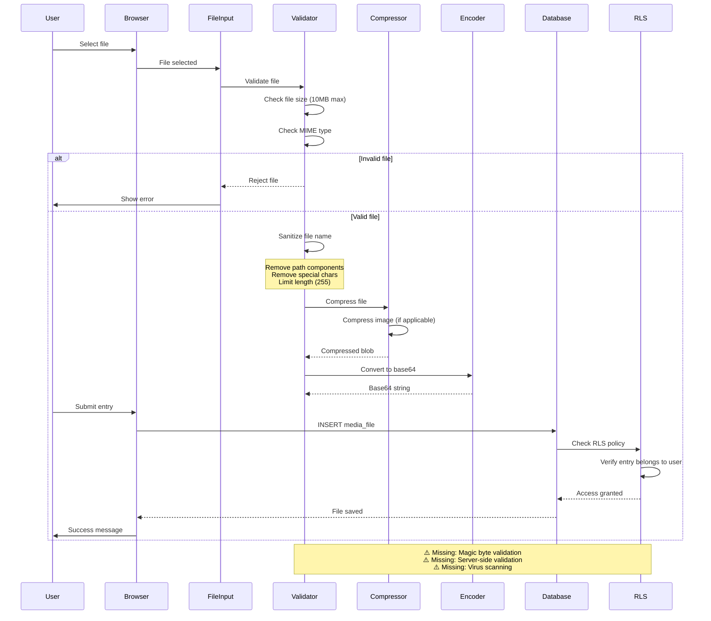

---

## Security Layers Diagram

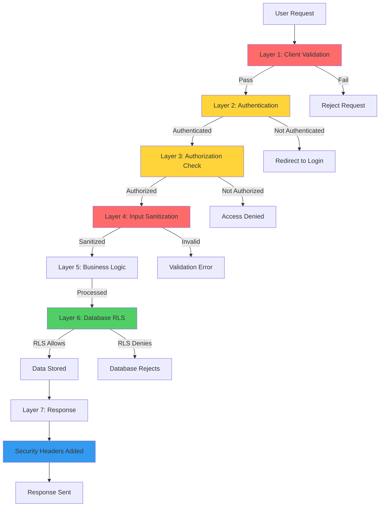

---

## Database Security Architecture

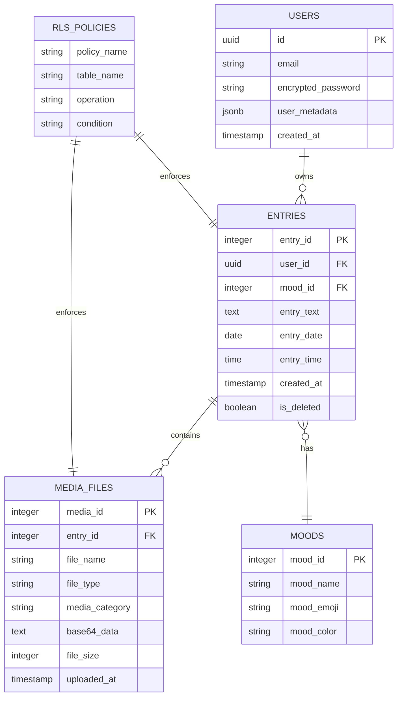

---

## Notes on Diagrams

### Sequence Diagrams
- Show the flow of operations with security checks
- Highlight authentication and authorization steps
- Demonstrate RLS policy enforcement
- Show error handling paths

### UML Class Diagram
- Shows relationships between entities
- Highlights security components
- Demonstrates service layer architecture
- Shows data flow through security layers

### Security Flow Diagram
- Illustrates defense-in-depth approach
- Shows multiple security checkpoints
- Demonstrates fail-safe mechanisms
- Highlights security logging points

---

**Last Updated:** 2024

